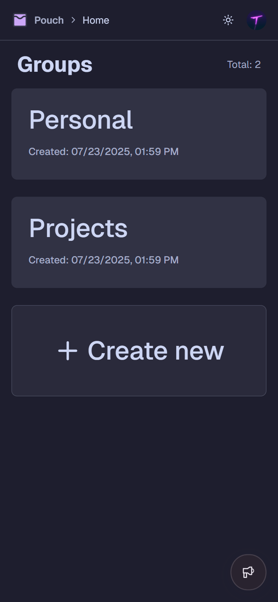

# Pouch

Store your favorite things.




---

## Overview

Pouch is a modern, full-stack web application for organizing and storing your favorite things. It features group-based organization, collaborative notepads, sortable lists, and robust authentication. Built with Next.js (App Router), Convex, Clerk, and Sentry, Pouch is designed for speed, reliability, and a delightful user experience.

---

## Features

- **Groups**: Organize your items into groups, each with a name and description.
- **List Items**: Add, edit, delete, and reorder text or URL items within groups. Drag-and-drop supported.
- **Notepad**: Each group has a collaborative notepad for freeform notes, with real-time syncing and edit status.
- **Authentication**: Secure OAuth login via Clerk, with Bearer token and `?token` query param support for API access.
- **API**: RESTful API with OpenAPI/Swagger documentation at `/api/swagger`.
- **Breadcrumb Navigation**: Context-aware breadcrumbs for easy navigation.
- **Dark/Light Theme**: Catppuccin-inspired theming with automatic dark/light mode.
- **Sentry Integration**: Error tracking, performance monitoring, and structured logging.

---

## Project Structure

```
convex/           # Backend logic, Convex schema, auth config
src/app/          # Next.js App Router, pages, API routes
src/components/   # Shared React components (UI, providers, features)
src/lib/          # Utilities, API schemas, error handling
src/styles/       # Global CSS (Tailwind, Catppuccin theme)
public/           # Static assets (logo, screenshots)
sentry.*.ts       # Sentry instrumentation (client, server, edge)
```

---

## Getting Started

### Prerequisites

- [Node.js](https://nodejs.org/) (v18+ recommended)
- [pnpm](https://pnpm.io/) (used for all package management)

### Installation

```sh
pnpm install
```

### Development

- Start the development server (Next.js + Convex):
  - **Note:** Do not run `pnpm dev` from the assistant. Please run it manually.

### Build & Preview

```sh
pnpm build
pnpm preview
```

---

## API

- RESTful API endpoints under `/api/` (see `/src/app/api/`)
- OpenAPI/Swagger docs: [GET /api/swagger](http://localhost:3000/api/swagger)
- Consistent JSON response structure, validated with Zod
- Standard HTTP error codes and error format
- Auth via Bearer token or `?token` query param

Example response:

```json
{
  "data": {
    /* ... */
  },
  "error": null
}
```

---

## Authentication

- OAuth via Clerk
- API requests require a Bearer token or `?token` query param
- See [`src/lib/api/auth.ts`](src/lib/api/auth.ts) for extraction logic

---

## Tech Stack

- **Frontend**: Next.js (App Router), React, Tailwind CSS, Catppuccin theme
- **Backend**: Convex (serverless database & functions)
- **Auth**: Clerk
- **API Validation**: Zod
- **Drag & Drop**: SortableJS
- **State Management**: Zustand, TanStack Query
- **Error Tracking**: Sentry

---

## Sentry & Logging

- Sentry is configured for client, server, and edge (see `src/instrumentation-client.ts`, `sentry.server.config.ts`, `sentry.edge.config.ts`)
- Logs, errors, and performance traces are sent to Sentry
- Use `Sentry.captureException(error)` for error reporting
- Use `Sentry.startSpan` for custom performance spans
- See [Sentry documentation](https://docs.sentry.io/platforms/javascript/guides/nextjs/) for more

---

## Theming

- Catppuccin Latte (light) and Mocha (dark) themes
- Automatic theme switching based on system preference
- Customizable via Tailwind and CSS variables in `src/styles/globals.css`

---

## License

This project is licensed under the [Apache License 2.0](LICENSE).
