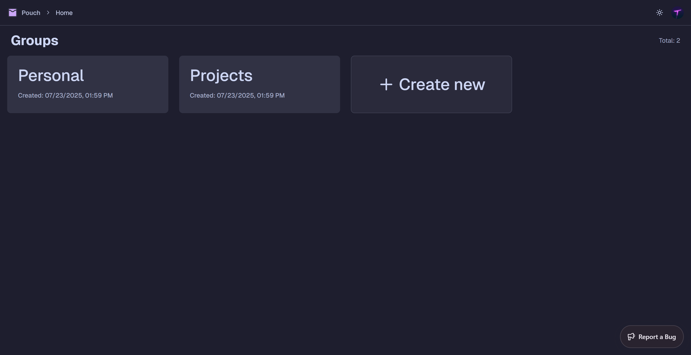

#  Pouch

Store your favorite things.

[](public/screenshots)

## Overview

Pouch is a modern, full-stack web application for organizing and storing your favorite things. Sortable lists, added to groups, automatically synchronized across your devices. Built with [Next.js (App Router)](https://nextjs.org/docs/app), [Convex](https://www.convex.dev), [Clerk](https://clerk.com), and [Sentry](https://sentry.io), Pouch is designed for speed, reliability, and a ease of use.

## Features

- **Groups**: Organize your lists and notepads into groups, each with a name and description.
- **Lists**: Add, edit, delete, and reorder text or URL items within groups. Drag-and-drop supported.
- **Notepads**: Each group has a collaborative notepad for freeform notes, with real-time syncing and live updates.
- **Authentication**: Secure OAuth login via Clerk with Bearer token support for API access.
- **API**: RESTful API with OpenAPI/Swagger documentation available at `/api/swagger`.
- **Breadcrumb Navigation**: Context-aware breadcrumbs for easy navigation.
- **Dark/Light Theme**: Catppuccin based themes with dark and light mode.
- **Sentry Integration**: Error tracking and monitoring with Sentry.

## Project Structure

```
convex/           # Backend logic, Convex schema, auth config
src/app/          # Next.js App Router, pages, API routes
src/components/   # Shared React components (UI, providers, features)
src/lib/          # Utilities, API schemas, error handling
src/styles/       # Global CSS (Tailwind, Catppuccin theme)
public/           # Static assets (logo, screenshots)
sentry.*.ts       # Sentry instrumentation (client, server, edge)
```

## Getting Started

### Prerequisites

- [Node.js](https://nodejs.org/)
- [pnpm](https://pnpm.io/)

### Installation

```sh
pnpm install
```

### Development

Start the development server (Next.js + Convex):

```sh
pnpm dev
```

### Build & Preview

```sh
pnpm build
pnpm start
```

## Deployment

This project is deployed to [Vercel](https://vercel.com) which also handles production Convex deployment.

## API

- RESTful API endpoints under `/api/` (see `/src/app/api/`)
- OpenAPI/Swagger docs: [GET /api/swagger](http://localhost:3000/api/swagger)
- Consistent JSON response structure with Zod validation
- Standard HTTP error codes and error format
- Authentication via Bearer token or `?token` query parameters.

Example response:

```json
{
  "data": {
    /* ... */
  },
  "error": null
}
```

## Tech Stack

- **Frontend**: Next.js (App Router), React, Tailwind CSS, Catppuccin theme - Built using [Create T3 App](https://create.t3.gg/) initially.
- **Backend**: Convex (serverless database & functions)
- **Clerk**: Authentication.
- **Sentry**: Error tracking and monitoring.
- **SortableJS**: Drag & Drop for list items.
- **TanStack Query**: Queries and mutations.
- **Zod**: Used throughout the project for both API and client-side form validation.
- **Zustand**: State management.

## Theming

- Catppuccin Latte (light) and Mocha (dark) themes
- Automatic theme switching based on system preference using next-themes with a theme switcher.
- Customizable via Tailwind and CSS variables in `src/styles/globals.css`.
- Based on [Shadcn UI](https://ui.shadcn.com/docs/themes) and [Catppuccin](https://github.com/catppuccin/catppuccin) themes.

## License

This project is licensed under the [Apache License 2.0](LICENSE).

## Contributing

You are welcome to contribute to this project. You can also fork it and use it as a template for your own projects according to the [Apache License 2.0](LICENSE).

To run your own instance, you will need to setup your own Convex and Clerk projects. Follow the official documentation to get started.

The required environment variables for the project can be found in the [env.js](src/env.js) file.
